# SYNAPSE-X
### Autonomous AI Engineering Organism


---

## 🧬 Overview

**SYNAPSE-X** is a self-organizing, hierarchical multi-agent system designed to autonomously architect, build, and deploy software systems. Unlike traditional linear pipelines, SYNAPSE-X operates as a living digital organism — spawning specialized child agents (Dev, DevOps, QA) on demand, healing its own code defects via a Doctor Agent, and visualizing its cognitive process in real-time.

> *"The system that builds systems."*

---

## 🧠 Core Architecture

The system follows a strict **Parent-Child-Doctor** hierarchy:

```mermaid
graph TD
    User([User Prompt]) -->|1. Intention| Parent[Parent Orchestrator]
    Parent -->|2. Spawn| Dev[Dev Agents α/β]
    Parent -->|2. Spawn| Ops[DevOps Agent]
    
    subgraph "Execution Layer"
        Dev -->|Code Gen| FileSystem
        Ops -->|Docker/CI| FileSystem
    end
    
    FileSystem -->|3. Audit| Doctor[Doctor Agent]
    Doctor -->|4. Heal| FileSystem
    Doctor -->|5. Report| Parent
```



### Key Components

| Component | Role | Description |
|-----------|------|-------------|
| **Orchestrator** | Cortex | Analyzes intent, plans architecture, and spawns child agents. |
| **Dev Agents** | Limbs | specialized sub-agents for frontend, backend, and logic implementation. |
| **DevOps Agent** | Infrastructure | Handles Dockerfiles, CI/CD pipelines, and cloud deployment configs. |
| **Doctor Agent** | Immune System | Continuously scans code for syntax errors, bugs, and security flaws — auto-patching them. |
| **MCP Gateway** | Senses | Connects the organism to external tools (Git, Logs, Deployment Specs) via Model Context Protocol. |
| **Neural Dashboard** | Visual Cortex | A "Minority Report" style interface visualizing the real-time agent tree and system health. |

---

## 🚀 Features

- **Cinematic Visualization**: Watch your software being built in a star-map style agent tree.
- **Self-Healing Code**: The Doctor Agent detects broken code and fixes it before deployment.
- **MCP Integration**: Fully compliant with Anthropic's Model Context Protocol for tool extensibility.
- **Dual-Mode Runtime**: 
  - **Auto-Pilot**: Give a prompt and watch it build.
  - **Human-in-the-Loop**: Pause execution, inspect agent memory, and guide the process.

---

## 🛠️ Installation & Usage

### Prerequisites
- Python 3.10+
- Node.js 16+
- Docker (optional, for containerization)

### 1. Clone & Setup
```bash
git clone https://github.com/synapse-x-org/AI-Systems-Architect.git
cd AI-Systems-Architect
```

### 2. Backend (The Brain)
```bash
cd synapse-x-mvp
python -m venv venv
source venv/bin/activate  # or venv\Scripts\activate on Windows
pip install -r requirements.txt
uvicorn main:app --reload
```

### 3. Frontend (The View)
```bash
cd synapse-x-frontend
npm install
npm run dev
```

Visit **http://localhost:3000** to access the Neural Dashboard.

---

## 🎥 Workflow Visualization

*(See `agent_flow.mp4` for a cinematic tour)*

---

## 🤝 Contributing

We welcome contributions! Please see `CONTRIBUTING.md` for details on how to propose changes to the organism's DNA.

## 📄 License

MIT © 2026 SYNAPSE-X
