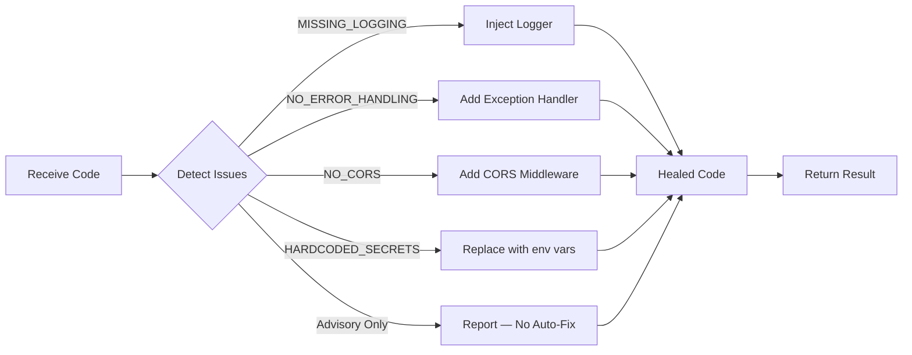

# SYNAPSE-X — Agent Architecture Documentation

## Overview

SYNAPSE-X (Self-Organizing AI Engineering Organism) is a hierarchical multi-agent system
that transforms a single natural-language prompt into a fully scaffolded software project—
complete with backend code, deployment artifacts, automated healing, and observability.

---

## Agent Hierarchy

```
                    ┌─────────────────┐
                    │  🌱 User Prompt │
                    └────────┬────────┘
                             │
                    ┌────────▼────────┐
                    │ 🧠 Parent Agent │   ◄── Cognitive Architect
                    │  (Trunk)        │       Intent analysis, task decomposition,
                    └──┬──────────┬───┘       spawning plan
                       │          │
            ┌──────────▼┐    ┌───▼──────────┐
            │ 💻 Dev    │    │ 🚀 DevOps    │   ◄── Child Agents (Branches)
            │ Agent     │    │ Agent        │       Code gen, infra gen
            └─────┬─────┘    └──────┬───────┘
                  │                 │
                  └────────┬────────┘
                    ┌──────▼──────┐
                    │ 🩺 Doctor   │   ◄── Healing Intelligence (Canopy)
                    │ Agent       │       Audit, patch, improve
                    └──┬──────┬───┘
                       │      │
              ┌────────▼┐  ┌─▼────────┐
              │ 📊 Logs │  │ 🐙 GitHub│   ◄── MCP Servers (Roots)
              │ MCP     │  │ MCP      │       Observability, persistence
              └─────────┘  └──────────┘
```

---

## Agent Responsibilities

### 🧠 Parent Agent — `agents/parent_agent.py`
| Capability            | Detail                                                |
|-----------------------|-------------------------------------------------------|
| Prompt ingestion      | Accepts any natural-language build request             |
| Intent analysis       | Classifies intent into architecture/backend/deployment |
| Task decomposition    | Generates structured task graph with priorities        |
| Spawning plan         | Decides which child agents to activate                 |
| LLM integration       | Uses Gemini API if key present; else rule-based        |

### 💻 Developer Agent — `agents/dev_agent.py`
| Capability            | Detail                                                |
|-----------------------|-------------------------------------------------------|
| Code generation       | Produces syntactically valid FastAPI scaffolds         |
| Route definitions     | Creates RESTful endpoint stubs                        |
| Model generation      | Adds Pydantic models for request/response schemas     |

### 🚀 DevOps Agent — `agents/devops_agent.py`
| Capability            | Detail                                                |
|-----------------------|-------------------------------------------------------|
| Dockerfile            | Multi-stage, security-hardened container image         |
| Deployment script     | Bash script for docker build/run                      |
| CI/CD config          | GitHub Actions workflow with lint, test, deploy stages |

### 🩺 Doctor Agent — `agents/doctor_agent.py`
| Capability            | Detail                                                |
|-----------------------|-------------------------------------------------------|
| Static analysis       | Regex-based issue detection (6 rule categories)       |
| Healing patches       | Auto-fixes: logging, error handling, CORS, secrets    |
| LLM critique          | Optional Gemini-powered code review                   |
| Improvement summary   | Returns per-issue status and fix descriptions         |

---

## Communication Flow

```
1.  User  ──[prompt]──▷  Parent Agent
2.  Parent ──[task_graph]──▷  Dev Agent
3.  Parent ──[task_graph]──▷  DevOps Agent
4.  Dev    ──[service_code]──▷  Doctor Agent
5.  DevOps ──[artifacts]──▷  Doctor Agent
6.  Doctor ──[healed_code]──▷  GitHub MCP (push)
7.  All    ──[events]──▷  Logs MCP (store)
8.  Router ──[unified_json]──▷  FastAPI Response
```

All communication is **synchronous within the pipeline** and uses Python function calls—
no message queues or network hops are needed for the MVP.

---

## Healing Lifecycle



Issue detection is **deterministic** (regex-based). If `GEMINI_API_KEY` is set,
an additional LLM critique pass is appended to the improvement summary.

---

## MCP Integrations

| MCP Server   | Mode   | Functions                          |
|-------------|--------|------------------------------------|
| GitHub MCP  | Mock   | `create_repo`, `push_code`, `list_commits` |
| Logs MCP    | Live   | `store_log`, `get_logs`, `clear_logs`      |

The GitHub MCP uses an in-memory store to simulate repository operations.
The Logs MCP is a **fully functional** thread-safe log store with filtering support.

---

## Execution Pipeline

```
POST /build { "prompt": "Build a todo app" }
      │
      ▼
┌─ Orchestration Router ──────────────────────────────┐
│  1. Parent Agent   → analyze(prompt)                │
│  2. Dev Agent      → generate(prompt, task_graph)   │
│  3. DevOps Agent   → generate(prompt, task_graph)   │
│  4. Doctor Agent   → audit_and_heal(dev_output)     │
│  5. GitHub MCP     → create_repo + push_code        │
│  6. Logs MCP       → store_log (at each stage)      │
└─────────────────────────────────────────────────────┘
      │
      ▼
  Unified JSON Response (all stage outputs)
```

A single `POST /build` call triggers the entire pipeline. The `/logs` endpoint
provides access to stored observability data.
